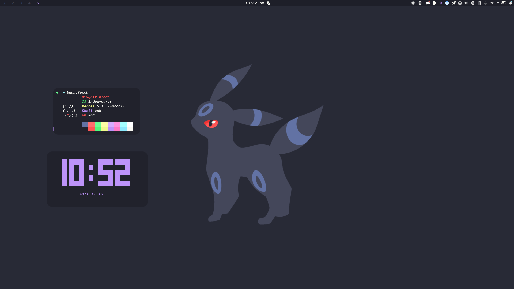
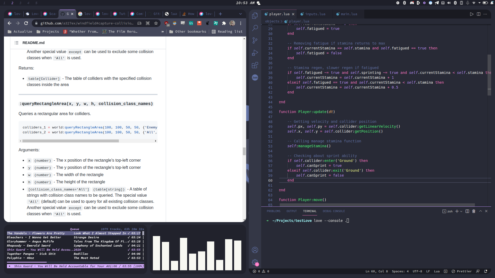

# Dracula i3-Plasma Dotfiles

## Screenshots

|  |  |
| ------------------------------------------------------ | ---------------------------------------------------------- |
| Empty                                                  | Populated                                                  |

## Dependencies

**i3-gaps-rounded:** [GitHub](https://github.com/resloved/i3) | [AUR](https://aur.archlinux.org/packages/i3-gaps-rounded-git/)

**picom jonaburg:** [GitHub](https://aur.archlinux.org/packages/i3-gaps-rounded-git/) | [AUR](https://aur.archlinux.org/packages/picom-jonaburg-git/)

**ncspot:** [GitHub](https://github.com/hrkfdn/ncspot) | [AUR](https://aur.archlinux.org/packages/ncspot-git/)

**kde plasma:** in official repos (includes konsole)

**konsole:** In official repos, Dracula theme [here](https://draculatheme.com/konsole)

**feh:** In official repos

### Optional Dependencies

**chrome:** You can also just change the browser in i3 config

**cava:** Visualizer from screenshot, [GitHub](https://github.com/karlstav/cava) | [AUR](https://aur.archlinux.org/packages/cava/)

## Setup

1. Clone repo
2. Copy files from .config folder in cloned repo to .config in your home directory
3. Copy wallpaper.png to ~/Pictures (optional, this is just the default for setting the wallpaper)
4. Move i3-plasma.desktop to /usr/share/xsessions
5. Sign out and sign back into the new i3-plasma option in SDDM

